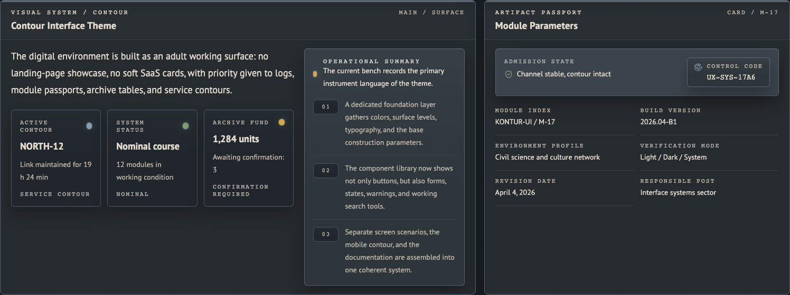

# Kontur UI

[English](./README.md) | [Русский](./README.ru.md)

`Kontur UI` is a public demo and reference repository built with `Vite`, `React`, `TypeScript`, and `Tailwind CSS v4`.

It presents a complete interface language for dense operational products: registries, logs, document-like blocks, section grammar, state markers, and carefully separated light and dark surfaces. The goal is not to ship a neutral dashboard kit. The goal is to document a specific visual system and show how it can be implemented in code.



## What This Repository Is

- A reference implementation of the `Kontur` theme.
- A runnable demo of tokens, sections, chrome patterns, and data-heavy screens.
- A codebase that shows how theme switching, locale switching, and semantic styling can work together.
- A starting point for teams exploring calm, service-oriented, engineering-documentary interfaces.

## Why It Exists

Many examples of internal tooling drift toward the same few aesthetics:

- fintech dashboard
- SaaS admin panel
- startup product UI
- generic documentation site

`Kontur UI` exists to show a different direction: a mature working surface built around state reading, records, archives, and control grammar instead of marketing rhythms and floating card grids.

## What It Solves

- Shows how to build a non-generic operational theme with a stable visual identity.
- Keeps theme foundations in semantic CSS variables instead of scattering raw colors across components.
- Supports `light`, `dark`, and `system` modes without visible theme flash.
- Makes `RU / EN` switching visible in the interface and persistent in storage.
- Demonstrates data-first composition with logs, registries, tables, module passports, and service notes.
- Documents how to extend the theme without losing its tone, hierarchy, or section grammar.

## What It Does Not Solve

- It is not a full productized design system package with stable component APIs.
- It is not a universal component library for arbitrary product styles.
- It is not an application with real backend workflows or domain logic.
- It is not a UI kit for landing pages, marketing sites, or consumer mobile apps.
- It is not a public npm package and does not promise API stability beyond the exported theme entry.

## Who Should Use It

- Designers exploring data-heavy interfaces outside standard SaaS conventions.
- Frontend engineers who want a concrete semantic-theming reference.
- Teams building archival, registry-based, documentary, or control-room-like products.

If you need a neutral base for many brands and many tone-of-voice directions, this repository is probably the wrong starting point.

## How To Run

```bash
npm install
npm run dev
```

## How To Verify

```bash
npm test
npm run build
```

## How To Use It

- Open the demo and inspect the sections as a reference implementation.
- Reuse semantic tokens from [`src/styles/theme.css`](./src/styles/theme.css).
- Reuse structural patterns from [`src/components/`](./src/components) and [`src/sections/`](./src/sections).
- Adapt the copy, tokens, and modules to your own product while preserving the semantic layer.

## Reusing The Theme In Another Project

After `npm run build`, the repository writes a reusable theme layer into `dist/theme/`.
The exported `theme.css` is a Tailwind CSS v4 source layer for internal or workspace consumers, not a compiled standalone stylesheet.

Usage:

```tsx
import "kontur-ui/theme.css";
import { useThemeMode } from "kontur-ui/theme";
```

What gets reused:

- `theme.css` with semantic tokens, both theme variants, and Tailwind v4 token mapping
- `kontur-theme.js` with runtime helpers
- `kontur-theme.d.ts` with TypeScript types
- Product copy and locale runtime stay in the consuming application

## Repository Structure

```text
.
├── index.html
├── package.json
├── src
│   ├── components/
│   ├── data/
│   ├── lib/
│   ├── sections/
│   └── styles/
└── README.md
```

## Theme Architecture

### Semantic tokens

Reusable theme tokens live in [`src/styles/theme.css`](./src/styles/theme.css):

- `:root` contains light-theme semantic variables
- `[data-theme="dark"]` contains dark-theme overrides
- `@theme inline` maps `--sys-*` variables to Tailwind v4 utility tokens

Components use semantic classes such as `bg-panel`, `text-text-primary`, and `border-border-strong` instead of raw hex values.
The demo-specific layout and chrome styles stay in [`src/styles/app.css`](./src/styles/app.css), which imports the theme source layer.

### Runtime logic

- [`src/lib/theme.ts`](./src/lib/theme.ts) handles theme mode, storage, system preference, and root attributes.
- [`src/lib/locale.tsx`](./src/lib/locale.tsx) handles locale state, persistence, and `html[lang]` for the demo only.
- [`src/data/locale.ts`](./src/data/locale.ts) stores localized UI copy for the demo in `ru` and `en`.

### Visual grammar

- [`src/components/chrome/`](./src/components/chrome) contains the top status bar, logs, tables, and other chrome patterns.
- [`src/components/ui/`](./src/components/ui) contains reusable UI primitives.
- [`src/sections/`](./src/sections) contains the full demo flow: overview, foundations, components, data display, section grammar, layouts, mobile preview, and docs.

## Extending The Theme

When adding a new module:

1. Add or adjust semantic tokens in [`src/styles/theme.css`](./src/styles/theme.css).
2. Map new tokens in `@theme inline` only when a Tailwind utility token is actually needed.
3. Build the module from semantic surfaces, borders, labels, and spacing rhythm.
4. Verify light and dark as two independent versions of one system.
5. Check that the result still reads as a calm operational interface rather than SaaS, fintech, or marketing UI.
