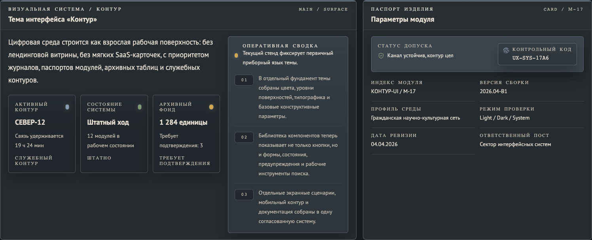

# Kontur UI

[English](./README.md) | [Русский](./README.ru.md)

`Kontur UI` это публичный демонстрационный репозиторий и эталонная тема, собранная на `Vite`, `React`, `TypeScript` и `Tailwind CSS v4`.

Он показывает целостный язык интерфейса для плотных рабочих систем: реестры, журналы, документные блоки, секционную грамматику, метки состояния и аккуратно разведённые светлые и тёмные поверхности. Это не попытка сделать нейтральный набор виджетов. Это попытка зафиксировать конкретную визуальную систему и показать, как она реализуется в коде.



## Что Это За Репозиторий

- Эталонная реализация темы `Kontur`.
- Запускаемая демонстрация токенов, секций, служебных приёмов и экранов, насыщенных данными.
- Кодовая база, показывающая, как вместе работают переключение темы, переключение языка и семантическое оформление.
- Стартовая точка для команд, которым нужен спокойный служебный и инженерно-документный язык интерфейса.

## Зачем Он Нужен

Многие примеры внутренних интерфейсов в итоге сводятся к одному и тому же типу:

- финансовая панель
- типовая облачная административная панель
- стартап-продукт
- типовой сайт документации

`Kontur UI` нужен, чтобы показать другую траекторию: зрелую рабочую поверхность, построенную вокруг чтения состояния, учётных записей, архивов и управляющей грамматики, а не вокруг маркетингового ритма и плавающей сетки карточек.

## Какие Задачи Он Решает

- Показывает, как собрать рабочую тему с устойчивым визуальным характером, не похожую на типовые решения.
- Держит основу темы в семантических CSS-переменных, а не разбрасывает цвета по компонентам.
- Поддерживает режимы `light`, `dark` и `system` без заметной вспышки темы при загрузке.
- Делает переключение `RU / EN` видимым в интерфейсе и сохраняемым в хранилище браузера.
- Показывает композицию с приоритетом данных через журналы, реестры, таблицы, паспорта модулей и служебные пояснения.
- Объясняет, как расширять тему, не ломая её тон, иерархию и секционную грамматику.

## Какие Задачи Он Не Решает

- Это не готовый пакет дизайн-системы для промышленного внедрения.
- Это не универсальная библиотека компонентов для любых продуктовых стилей.
- Это не приложение с реальной серверной логикой и рабочими бизнес-процессами.
- Это не набор интерфейсов для лендингов, рекламных сайтов или потребительских мобильных приложений.
- Это не версия npm-пакета с обещанной стабильностью внешнего API.

## Кому Он Подходит

- Дизайнерам, которые исследуют насыщенные данными интерфейсы вне стандартных облачных административных решений.
- Фронтенд-инженерам, которым нужен конкретный референс по семантической теме.
- Командам, которые делают архивные, реестровые, документные или диспетчерские продукты.

Если вам нужен нейтральный каркас под много брендов и много интонаций, этот репозиторий, скорее всего, не лучшая основа.

## Как Запустить

```bash
npm install
npm run dev
```

## Как Проверить

```bash
npm test
npm run build
```

## Как Использовать

- Откройте демонстрацию и просмотрите секции как эталонную реализацию темы.
- Переиспользуйте семантические токены из [`src/styles/app.css`](./src/styles/app.css).
- Переиспользуйте структурные приёмы из [`src/components/`](./src/components) и [`src/sections/`](./src/sections).
- Адаптируйте тексты, токены и модули под свой продукт, сохраняя семантический слой.

## Структура Репозитория

```text
.
├── index.html
├── package.json
├── src
│   ├── components/
│   ├── data/
│   ├── lib/
│   ├── sections/
│   └── styles/app.css
└── README.md
```

## Архитектура Темы

### Семантические токены

Токены темы лежат в [`src/styles/app.css`](./src/styles/app.css):

- `:root` содержит семантические переменные светлой темы
- `[data-theme="dark"]` содержит переопределения для тёмной темы
- `@theme inline` маппит `--sys-*` переменные в служебные токены Tailwind v4

Компоненты используют семантические классы вроде `bg-panel`, `text-text-primary` и `border-border-strong`, а не прямые шестнадцатеричные значения цветов.

### Логика работы

- [`src/lib/theme.ts`](./src/lib/theme.ts) управляет режимом темы, хранилищем, системными настройками и атрибутами корневого элемента.
- [`src/lib/locale.tsx`](./src/lib/locale.tsx) управляет текущим языком, его сохранением и `html[lang]`.
- [`src/data/locale.ts`](./src/data/locale.ts) хранит локализованные тексты интерфейса для `ru` и `en`.

### Визуальная грамматика

- [`src/components/chrome/`](./src/components/chrome) содержит верхнюю статусную строку, журналы, таблицы и другие служебные элементы.
- [`src/components/ui/`](./src/components/ui) содержит переиспользуемые примитивы интерфейса.
- [`src/sections/`](./src/sections) содержит полный состав демонстрации: обзор, основы темы, компоненты, показ данных, секционную грамматику, шаблоны экранов, мобильный контур и документацию.

## Как Расширять Тему

Если вы добавляете новый модуль:

1. Добавьте или скорректируйте семантические токены в [`src/styles/app.css`](./src/styles/app.css).
2. Маппьте новые токены в `@theme inline` только тогда, когда действительно нужен служебный токен Tailwind.
3. Собирайте модуль из семантических поверхностей, рамок, подписей и ритма отступов.
4. Проверяйте светлую и тёмную темы как две самостоятельные версии одной системы.
5. Следите, чтобы результат всё ещё читался как спокойный рабочий интерфейс, а не как облачная административная панель, финансовый экран или рекламный интерфейс.

## Замечания Для Публичного Репозитория

- Репозиторий предназначен для публичной публикации на GitHub.
- В `package.json` сохранён `"private": true`, чтобы случайно не опубликовать пакет в npm. Публикации на GitHub это не мешает.
- Сгенерированные артефакты исключены через `.gitignore`.
- Лицензия `MIT` разрешает переиспользование при сохранении указания авторства.

## Готовность К Публикации

С точки зрения GitHub репозиторий выглядит готовым к публичной публикации: есть свободная лицензия, запускаемое приложение, тесты и рабочая сборка.

Главный оставшийся вопрос связан не с безопасностью, а с составом дерева. Если нужен более чистый публичный вид, стоит оставлять только пользовательскую документацию и убирать внутренние рабочие заметки.
